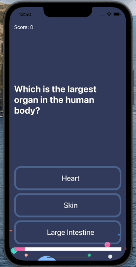

#  Quizzler

<h1 align="center" display="flex">
        Quizzler
     
</h1>

<h1 align="center">
  Quiz App Multiple Choice
</h1>

<h1 align="center">
     
</h1>

<h1 align="center">
  App ultilazando o padrão MVC
</h1>

* What is a design pattern and how is it used in programming.
* How to use the Model-View-Controller or MVC pattern for app development.
* Swift structures and functions with outputs.
* Learn about Object Oriented Programming.
* Learn to use UIAlertControllers to display popups to the user.
* How to refactor code and stay organised.
* Learn about object initialisation. 
* How to programmatically change UI elements such as Labels and Views.